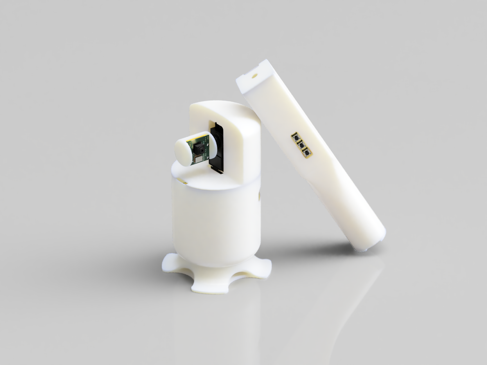
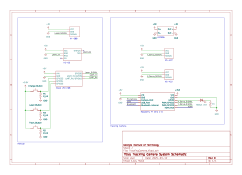

<h1 align="center">GT ECE 4180 Final Project Spring 2025</h1>

    <a href="">
        

            
        

    </a>
    Click for Demo Video

## Overview

A proof of concept for a presenter tracking camera with intuitive gesture controlled 2-axis pan and tilt. By prioritizing gesture control, presenters can easily divert the camera's attention to specific areas, allowing for more immursive remote presentations compared to footage produced by static viewpoint, multi-region selection, or solely presenter tracking systems.

## Dependencies

### Hardware
* __Raspberry Pi Zero 2 W__
    * Video footage capture/streaming, 2-axis servo control, respond to remote commands
* __mbed LPC1768__
    * Laser control, sending commands to tracking camera over Bluetooth
* __Inference Accelerator__
    * Presenter and gesture detection
    * For the purposes of this project, a MacBook with <ins>Metal Performance Shaders</ins> backend was used to emulate the functionality of a dedicated inference accelerator like the <ins>Coral Edge TPU</ins>
* __Raspberry Pi Camera v2__
    * Video footage capture
* __Hitech HS-422 Servo (x2)__
    * 2-axis camera orientation control
* __DSD TECH HC-05__
    * Bluetooth communication between mbed and RPi
* __LM2596 DC-DC Buck Converter__
    * Step down 9V power supply for RPi and servos
* __KY-008 Laser Module__
    * Laser pointer functionality
* __Miscellaneous__
    * HDMI Video Capture Card
    * Wireless microphone
    * Camera status LED
    * Mini-HDMI to HDMI adapter
    * Mini-USB to USB adapter
    * 5V Power Bank
    * 9V Power Supply

### Software
* __Tracking Camera__
    * Libraries:
        * pigpio
        * Picamera2
        * pySerial
        * NumPy (OpenBLAS backend)
    * System:
        * g_serial
        * LightDM (Disabled)
* __Inference Accelerator__
    * Libraries:
        * PyTorch
        * Ultralytics (YOLOv11)
        * NanoTrack
        * OpenCV
        * NumPy
        * pySerial
* __Remote__
    * N/A
* __Miscellaneous__
    * OBS Studio (HDMI Capture Card Virtual Camera)

## Schematic

## Issues / Unimplemented Improvements

* __Inpractical Laser Control__
    * The original goal of this project was to guide the camera's focus using a laser rather than gestures as it would allow for longer range control. However, the combination of significant camera noise and a low power laser (for safety reasons) made the task of reliably detecting a laser point impractical. Potentially with a higher quality camera or dedicated low exposure camera, reliability could be improved to usable standards.
* __Inconvenient External Inference__
    * Offloading inference to a completely external device is both inefficient and unreliable. A dedicated edge accelerator would allow for better performance and more efficient use of resources.
* __Footage Quality__
    * As a proof of concept, the Raspberry Pi Camera v2's noisy frames combined with the parallel compute bottleneck of the Raspberry Pi Zero 2 W severely degrade the final recording quality. A higher quality camera and better choice of processor (ideally extensive support for parallel operations) could easily elevate the output quality to acceptable levels.
* __Inefficient Use of Hardware__
    * Given the simplicity of the overall system, the microcontrollers are by no means being used in an efficient manner. Choosing microcontrollers more taylored to the requirements of the system would make it much more reasonable to use.